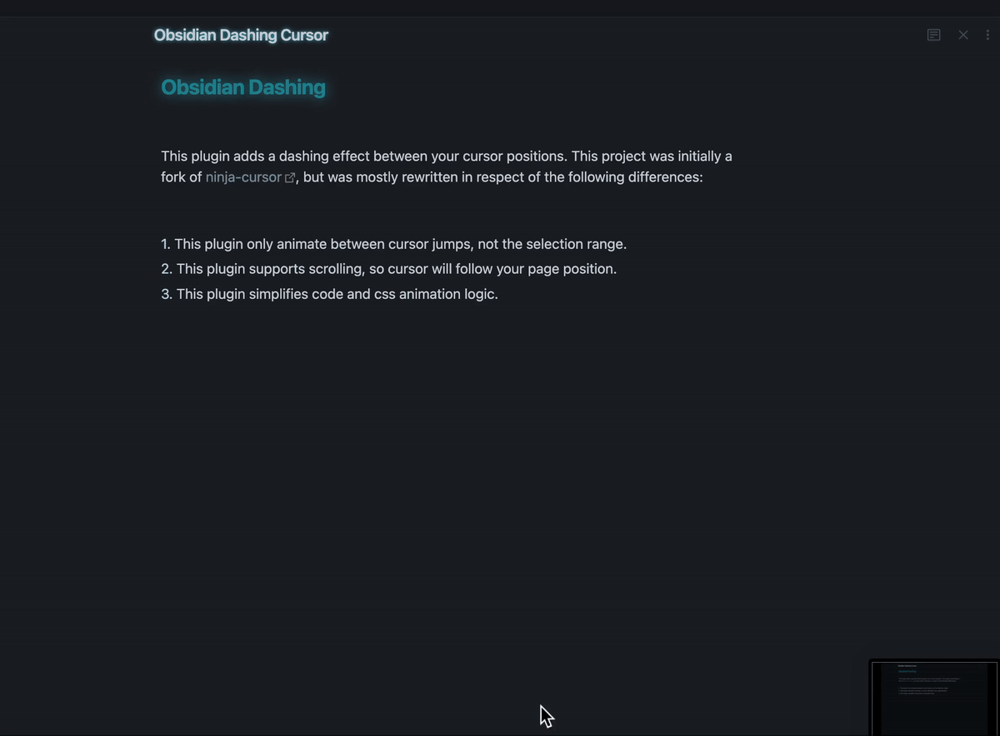

# Obsidian Dashing Cursor

This plugin adds a dashing effect between your cursor positions. This project was initially a fork of [ninja-cursor](https://github.com/vrtmrz/ninja-cursor), but was mostly rewritten in respect of the following differences:

1. This plugin only animate between cursor jumps, not the selection range.
2. This plugin supports scrolling, so cursor will follow your page position.
3. This plugin simplifies code and css animation logic.
